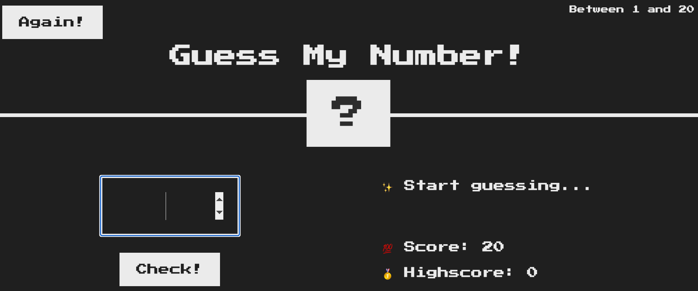
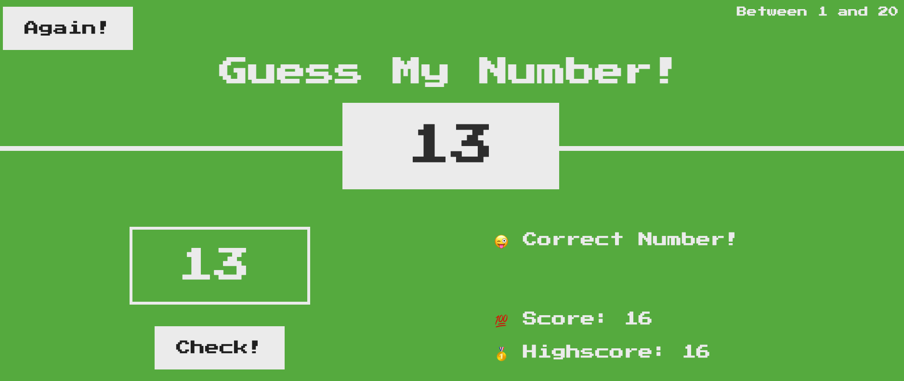

## Guess My Number Game

At the start of the game, a random number between 1 and 2 (inclusive of both) is generated. The goal of the game is to guess this number in the least number of attempts. 

User starts with `score: 20` and each time the guessed number is inocrrect, the `score` decreases by `1 point`.

### How to play
Simply clone the repo locally and open `index.html` using a web browser like Chrome, Firefox or Edge. Have fun!

